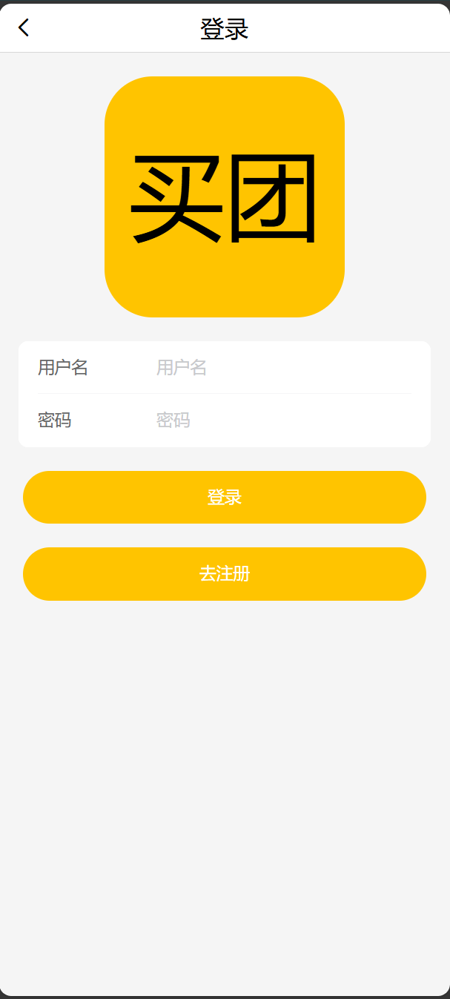
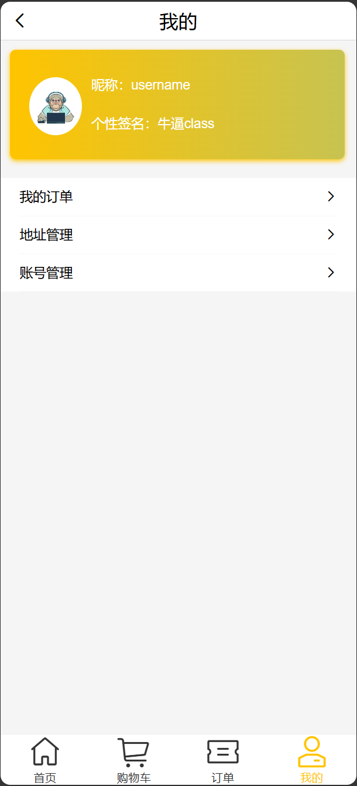
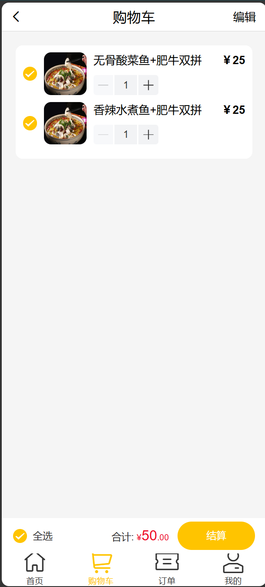
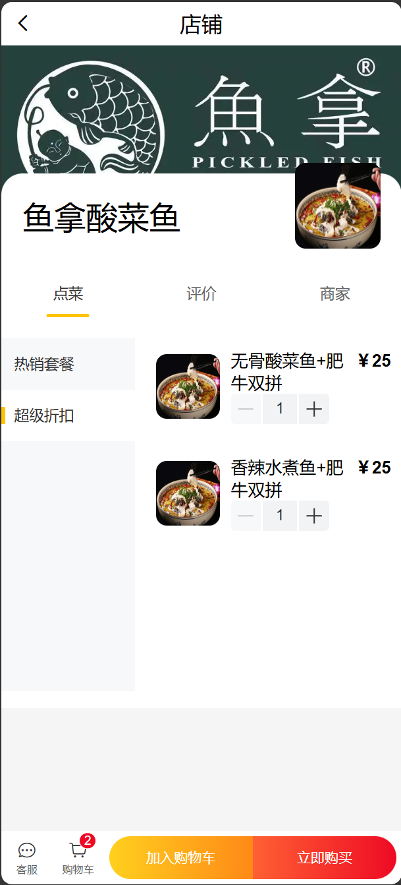

## 移动端通用外卖APP
>采用 **`vue3CLI`** 构建 

## 编写语言
* **`JavaScript`** 
* **`Vue`** 
* **`Less`** 
* **`CSS`** 
* **`HTML`** 
  
## 技术栈
* **`vant3`**：快速搭建网页UI 
* **`vue-router`**：实现动态路由，路由守卫，token验证 
* **`axios`**：路由请求二次封装 
* **`vuex`**：实现多组件间的通信交互 
* **`mockjs`**：实现数据模拟 
* **`localStorage`**：实现数据暂存 

## 运行环境
* **`node@20.15.0`** 
* **`npm@10.7.0`** 

## 运行使用
>**在项目跟目录打开终端运行以下命令**
* **安装依赖：`npm install`** 
* **项目运行：`npm run serve`** 

## 项目效果图
* 登陆页面展示：
 
* 订单页面展示：
 
* 主页展示：
 
* 用户页面展示：
 
* 购物车页面展示：
 
* 店铺页面展示：
 
